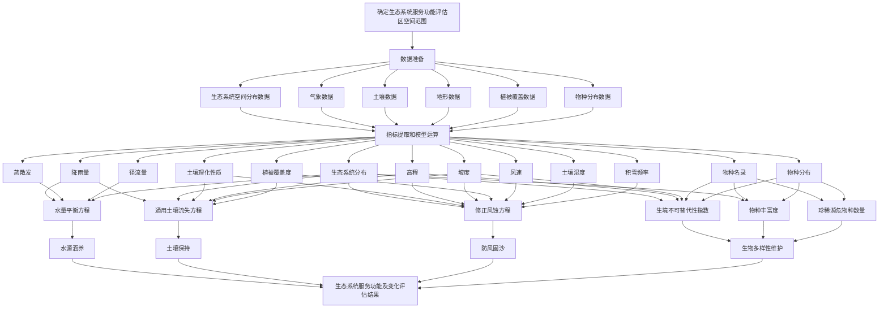

# 中华人民共和国国家生态环境标准

**HJ 1173—2021**

## 全国生态状况调查评估技术规范 ——生态系统服务功能评估

**Technical specification for investigation and assessment of national ecological status ——Ecosystem services assessment**

本电子版为正式标准文本，由生态环境部环境标准研究所审校排版。

---

2021-05-12 发布 2021-08-01 实施

生态环境部发布

---

## 目录

- [前言](#前言)
- [1 适用范围](#1-适用范围)
- [2 规范性引用文件](#2-规范性引用文件)
- [3 术语和定义](#3-术语和定义)
- [4 总则](#4-总则)
- [5 技术流程](#5-技术流程)
- [6 评估指标体系](#6-评估指标体系)
- [7 评估技术方法](#7-评估技术方法)
- [8 评估结果](#8-评估结果)
- [附录A（规范性附录） 生态系统服务功能指标计算方法](#附录a规范性附录-生态系统服务功能指标计算方法)

---

## 前言

为贯彻《中华人民共和国环境保护法》及相关法律法规，以及《全国生态状况定期遥感调查评估方案》（环办生态〔2019〕45 号），制定本标准。

本标准规定了生态系统服务功能评估的总则、技术流程、指标体系和技术方法等要求。

本标准的附录A为规范性附录。

本标准为首次发布。

本标准与以下标准同属全国生态状况调查评估技术规范系列标准：

- 《全国生态状况调查评估技术规范——生态系统遥感解译与野外核查》（HJ 1166—2021）
- 《全国生态状况调查评估技术规范——森林生态系统野外观测》（HJ 1167—2021）
- 《全国生态状况调查评估技术规范——草地生态系统野外观测》（HJ 1168—2021）
- 《全国生态状况调查评估技术规范——湿地生态系统野外观测》（HJ 1169—2021）
- 《全国生态状况调查评估技术规范——荒漠生态系统野外观测》（HJ 1170—2021）
- 《全国生态状况调查评估技术规范——生态系统格局评估》（HJ 1171—2021）
- 《全国生态状况调查评估技术规范——生态系统质量评估》（HJ 1172—2021）
- 《全国生态状况调查评估技术规范——生态问题评估》（HJ 1174—2021）
- 《全国生态状况调查评估技术规范——项目尺度生态影响评估》（HJ 1175—2021）
- 《全国生态状况调查评估技术规范——数据质量控制与集成》（HJ 1176—2021）

本标准由生态环境部自然生态保护司、法规与标准司组织制订。

本标准主要起草单位：中国科学院生态环境研究中心、生态环境部卫星环境应用中心。

本标准生态环境部2021年5月12日批准。

本标准自2021年8月1日起实施。

本标准由生态环境部解释。

---

## 1 适用范围

本标准规定了生态系统服务功能评估的内容、流程、评估指标体系和评估方法等。

本标准适用于全国及省级行政区域陆域生态系统服务功能评估，其他地理区域可参考本标准执行。

## 2 规范性引用文件

本标准引用了下列文件或其中的条款。凡是注明日期的引用文件，仅注日期的版本适用于本标准。凡是未注日期的引用文件，其最新版本（包括所有的修改单）适用于本标准。

- HJ 1168 全国生态状况调查评估技术规范——草地生态系统野外观测
- HJ 1169 全国生态状况调查评估技术规范——湿地生态系统野外观测
- HJ 1170 全国生态状况调查评估技术规范——荒漠生态系统野外观测

## 3 术语和定义

下列术语和定义适用于本标准。

### 3.1 生态系统服务 (ecosystem services)

生态系统为人类提供的防风固沙、土壤保持、水源涵养、生物多样性维护等方面的功能。

### 3.2 水源涵养 (water conservation)

生态系统通过其结构和过程拦截滞蓄降水，增强土壤下渗，涵养土壤水分和补充地下水，调节河川流量，增加可利用水资源量的功能。

### 3.3 土壤保持 (soil conservation)

生态系统通过其结构与过程保护土壤，降低雨水的侵蚀能力，减少土壤流失，防止泥沙淤积的功能。

### 3.4 防风固沙 (sand storm prevention)

生态系统通过增加土壤抗风能力，降低风力侵蚀和风沙危害的功能。

### 3.5 生物多样性维护 (biodiversity conservation)

生态系统在维持基因、物种、生态系统多样性发挥的作用。

## 4 总则

### 4.1 原则

生态系统服务功能评估应遵循规范性、可操作性、先进性和经济与技术可行性的原则。

### 4.2 目标和范围

本标准以遥感和地面调查数据为基础，结合生态系统长期监测数据，定量评估生态系统服务功能状况，了解生态系统服务功能的变化趋势。时间范围为有数据支撑的一年或多年，多年评估的基准年为第一年。空间范围为评估区。

## 5 技术流程

本标准制定了生态系统服务功能评估的技术流程，见图1。

## 6 评估指标体系

生态系统服务功能评估指标体系见表1。

| 评估科目 | 评估指标 | 指标定义 |
| -------- | -------- | -------- |
| 水源涵养 | 水源涵养量 | 生态系统通过拦截滞蓄降水，涵养土壤水分、调节地表径流和补充地下水所增加的水资源总量 |
| 土壤保持 | 土壤保持量 | 生态系统减少的土壤侵蚀量（潜在土壤侵蚀量与实际土壤侵蚀量的差值） |
| 防风固沙 | 防风固沙量 | 通过生态系统减少的因大风导致土壤流失和风沙危害的风蚀量 |
| 生物多样性维护 | 生境不可替代性指数 | 不可替代性指数是0～1之间的连续值，值越高代表所在规划单元的保护价值越高，能够替代该单元完成保护目标的其他规划单元数量越少 |
| 生物多样性维护 | 物种丰富度 | 生态系统群落中物种数目的多少 |
| 生物多样性维护 | 珍稀濒危物种数量 | 国家重点保护野生物种名录及世界自然保护联盟红色名录中的极危、濒危级别物种的数量 |

## 7 评估技术方法

### 7.1 水源涵养量

运用水量平衡方程计算水源涵养量，具体方法详见附录A。

### 7.2 土壤保持量

运用修正土壤流失方程（RUSLE）计算土壤保持量，具体方法详见附录A。

### 7.3 防风固沙量

运用修正风力侵蚀模型（REWQ）计算固沙量，具体方法详见附录A。

### 7.4 生境不可替代性指数

运用Marxan选址运算模型计算生境不可替代性指数，具体方法详见附录A。

### 7.5 物种丰富度

采用样方调查方法统计生态系统群落中物种数目的多少，具体参考HJ 1168、HJ 1169、HJ 1170。

### 7.6 珍稀濒危物种数量

采用调查统计的方法，统计区域内国家重点保护野生物种名录及世界自然保护联盟红色名录中的极危、濒危级别物种的数量。

## 8 评估结果

以水源涵养、土壤保持、防风固沙和生物多样性维护的评估结果为依据定量评估生态系统服务功能的空间格局和总体变化趋势，明确不同类型生态系统服务功能的变化情况及变化关键区域。水源涵养量、土壤保持量、防风固沙量、野生动物栖息地面积和物种丰富度越高或增加越快，生态系统服务功能越高或变化趋势向好。

---

## 附录A（规范性附录） 生态系统服务功能指标计算方法

### A.1 水源涵养量

计算生态系统通过拦截滞蓄降水，增强土壤下渗、蓄积，涵养土壤水分、调节地表径流和补充地下水所增加的水资源总量。通过水量平衡方程计算：

\[
Q_{wr} = \sum_{i=1}^{n} (A_i \times (P_i - R_i - ET_i)) \times 10^{-3}
\]

式中：

- \(Q_{wr}\) ——水源涵养量，m³/a；
- \(i\) ——第i类生态系统类型；
- \(n\) ——生态系统类型总数；
- \(A_i\)—— i类生态系统的面积，m²；
- \(P_i\)——产流降雨量，mm/a；
- \(R_i\)——地表径流量，mm/a；
- \(ET_i\)——蒸散发量，mm/a。

### A.2 土壤保持量

基于修正土壤流失方程（RUSLE）计算。

\[
Q_{sr} = Q_{se\_p} - Q_{se\_a}
\]

\[
Q_{se\_p} = R \times K \times L \times S
\]

\[
Q_{se\_a} = R \times K \times L \times S \times C
\]

式中：

- \(Q_{sr}\) ——土壤保持量，t/（hm²∙a）；
- \(Q_{se\_p}\) ——潜在土壤侵蚀量，t/（hm²∙a）；
- \(Q_{se\_a}\) ——实际土壤侵蚀量，t/（hm²∙a）；
- \(R\) ——降雨侵蚀力因子，MJ∙mm/（hm²∙h∙a）；
- \(K\) ——土壤可蚀性因子，t∙hm²∙h/（hm²∙MJ∙mm）；
- \(L\) ——坡长因子，量纲一；
- \(S\) ——坡度因子，量纲一；
- \(C\) ——植被覆盖因子，量纲一；

降雨侵蚀力因子（R）、土壤可蚀性因子（K）、坡长坡度因子（L、S）及植被覆盖因子（C）的计算方法如下。

降雨侵蚀力因子（R）是降雨引发土壤侵蚀的潜在能力，计算公式如下。

\[
R = \sum_{k=1}^{24} R_{k半月}
\]

\[
R_{k半月} = \sum_{i=1}^{n} \sum_{j=1}^{m} \left( \frac{P_{i,j,k}^{1.726}}{10} \right) \times \alpha
\]

式中：

- \(R\) ——多年平均年降雨侵蚀力，MJ∙mm/（hm²∙h∙a）；
- \(R_{k半月}\) ——第k个半月的降雨侵蚀力，MJ∙mm/（hm²∙h∙a）；
- \(k\) ——一年的24个半月，即k=1,2,…,24；
- \(i\) ——所用降雨资料的年份，即i＝1,2,…,n；
- \(j\) ——第i年第k个半月侵蚀性降雨日的天数，即j=1,2,…,m；
- \(P_{i,j,k}\) ——第i年第k个半月第j个侵蚀性日降雨量，mm；
- \(\alpha\)为参数，暖季\(\alpha=0.3937\)，冷季\(\alpha=0.3101\)。

降雨侵蚀力空间数据可以根据全国范围内气象站点多年的逐日降雨量资料，通过插值获得。

土壤可蚀性因子（K）反映了土壤颗粒被水力分离和搬运的难易程度，是评价土壤对侵蚀敏感程度的重要指标，主要与土壤质地、有机质含量、土体结构、渗透性等土壤理化性质有关。采用如下公式进行计算。

\[
K_{EPIC} = \left( 0.2 + 0.3 \times \exp\left[-0.0256 \times \left(\frac{1}{100}\right)\right] \right) \times \left(\frac{m_{silt}}{m_{silt} + m_{s}} \right)
\]

\[
K = 0.01383 + 0.515 \times K_{EPIC} - 0.1317
\]

式中：

- \(K_{EPIC}\) ——采用侵蚀-生产力评价模型计算的土壤可蚀性因子，t∙hm²∙h/（hm²∙MJ∙mm）；
- \(m_s\)——砂粒（0.05～2 mm）百分含量，%；
- \(m_{silt}\)——粉粒（0.002～0.05 mm）百分含量，%；
- \(m_c\)——黏粒（＜0.002 mm）百分含量，%；
- \(orgC\) ——有机碳的百分含量，%。

坡长和坡度因子（L、S）反映了坡长、坡度等对土壤侵蚀的影响，按照如下公式计算。

\[
L = \left(\frac{\lambda}{22.13}\right)^m
\]

\[
m = \frac{\beta}{1 + \beta}
\]

\[
\beta = \left(\frac{\sin\theta}{0.0896}\right) / \left(3.0 \times \sin\theta + 0.56\right)
\]

\[
S = \begin{cases} 
10.8 \times \sin\theta + 0.03 & \theta < 5.14° \\
16.8 \times \sin\theta - 0.5 & 5.14° \leq \theta < 10.20° \\
21.9 \times \sin\theta - 0.96 & 10.20° \leq \theta < 28.81° \\
9.598 & \theta \geq 28.81°
\end{cases}
\]

式中：

- \(L\) ——坡长因子；
- \(S\) ——坡度因子；
- \(m\) ——坡长指数；
- \(\theta\) ——坡度，（°）；
- \(\lambda\) ——坡长，m。

植被覆盖因子（C）反映了生态系统对土壤侵蚀的影响，是控制土壤侵蚀的积极因素。水田、湿地、城镇和荒漠分别赋值为0，0，0.01和0.7，其余各生态系统类型按不同植被覆盖度进行赋值，详见表A.1。旱地的植被覆盖因子按照以下公式计算：

\[
C = 0.221 - 0.595 \times \log c
\]

式中：

- \(C\) ——旱地的植被覆盖因子；
- \(c\) ——小数形式的植被覆盖度。

| 生态系统类型 | 植被覆盖度/% | <10 | 10～30 | 30～50 | 50～70 | 70～90 | >90 |
| ------------ | ------------ | --- | ------ | ------ | ------ | ------ | --- |
| 森林        | 0.10         | 0.08 | 0.06   | 0.02   | 0.004  | 0.001  |
| 灌丛        | 0.40         | 0.22 | 0.14   | 0.085  | 0.040  | 0.011  |
| 草地        | 0.45         | 0.24 | 0.15   | 0.09   | 0.043  | 0.011  |
| 乔木园地    | 0.42         | 0.23 | 0.14   | 0.089  | 0.042  | 0.011  |
| 灌木园地    | 0.40         | 0.22 | 0.14   | 0.087  | 0.042  | 0.011  |

### A.3 防风固沙量

采用修正风蚀方程RWEQ进行评价。

防风固沙量：

\[
SR = SL_{潜} - SL
\]

潜在风力侵蚀量：

\[
L_{潜} = \left[109.8 \times WF \times EF \times SCF\right]^{0.3711}
\]

实际风力侵蚀量：

\[
L = \left[109.8 \times WF \times EF \times SCF \times C\right]^{0.3711}
\]

式中：

- \(SR\)——固沙量，t/（km²∙a）；
- \(SL_{潜}\) ——潜在风力侵蚀量，t/（km²∙a）；
- \(SL\) ——实际风力侵蚀量，t/（km²∙a）；
- \(WF\) ——气候因子，kg/m；
- \(EF\) ——土壤可蚀因子；
- \(SCF\) ——土壤结皮因子；
- \(C\) ——植被覆盖因子。

气候因子（WF）计算方法如下：

\[
WF = Wf \times SW \times SD \times g
\]

式中：

- \(WF\) ——气候因子，单位，kg/m，12个月WF总和得到多年年均WF；
- \(Wf\) ——各月多年平均风力因子，
- \(\rho\) ——空气密度，
- \(g\) ——重力加速度；
- \(SW\) ——各月多年平均土壤湿度因子，量纲一；
- \(SD\) ——雪盖因子，量纲一。

土壤可蚀因子（EF）的计算方法如下：

\[
EF = 29.09 + 0.31 \times sa + 0.17 \times si + 0.33 \times (sa/cl) - 2.59 \times OM - 0.95 \times CaCo3
\]

式中：

- \(EF\) ——土壤可蚀因子；
- \(sa\) ——土壤粗砂含量（0.2～2 mm），%；
- \(si\) ——土壤粉砂含量，%；
- \(cl\) ——土壤黏粒含量，%；
- \(OM\) ——土壤有机质含量，%；
- \(CaCo3\) ——碳酸钙含量，%，可不予考虑。

土壤结皮因子（SCF）的计算方法如下：

\[
SCF = 1 + 0.006 \times (cl)^2 + 0.021 \times (OM)^2
\]

式中：

- \(SCF\) ——土壤结皮因子；
- \(cl\) ——土壤黏粒含量；
- \(OM\) ——土壤有机质含量。

植被覆盖因子（C）的计算方法如下：

\[
C = e^{a_i \times SC}
\]

式中：

- \(C\) ——植被覆盖因子；
- \(SC\) ——植被覆盖度；
- \(a_i\) ——不同植被类型的系数，分别为：林地取-0.1535，草地取-0.1151，灌丛取-0.0921，裸地取-0.0768，沙地取-0.0658，农田取-0.0438。

地表粗糙度因子（K’）的计算方法如下：

\[
K’ = e^{-0.934 \times (1.86 \times Kr + 2.41 \times Crr + 0.127 \times L)}
\]

\[
Kr = 0.2 \times \Delta H / L
\]

式中：

- \(K’\) ——地表粗糙度因子；
- \(Kr\) ——土垄糙度，以Smith-Carson方程加以计算，cm；
- \(Crr\) ——随机糙度因子，取0，cm；
- \(L\) ——地势起伏参数；
- \(\Delta H\) ——距离L范围内的海拔高程差。

### A.4 生境不可替代性指数

首先选择指示物种，根据历史数据，以县为单元确定每个指示物种的分布区。使用Marxan软件中的选址运算模型，按约束条件进行迭代计算得到全国生物多样性保护优先区域。

评估单元为评估区内的各县级行政单位，物种选择全国境内有记录分布的国家一级物种、二级物种和其他有重要保护价值的物种，参照中国动物志和植物志统计这些物种在每个评估单元中的出现数量。利用不可替代性指数为评估单元赋值，该数值在0～100分布，数值越高表示该单元对保护生物多样性的价值（不可替代性）越大。

Marxan模型的迭代运算目标函数为：

\[
\sum (PUs \times Cost) + BLM \times \sum Boundary + \sum (ConValue \times SPF) + CostThersholdPenalty(t)
\]

式中：

- \(\sum (PUs \times Cost)\) ——规划单元总成本；
- \(BLM \times \sum Boundary\) ——保护体系边界总长度修正值；
- \(\sum (ConValue \times SPF)\) ——未达到保护目标的补偿值；
- \(CostThersholdPenalty(t)\) ——超出成本阈值的补偿值。

运算过程中，每个规划单元采用相同成本，结果表示能达到保护目标的面积最小区域。保护体系边界总长度修正值为模型迭代过程中调整保护优先区边界后的保护体系边界总长度。当某个物种并未达到保护目标，但保护成本已达到阈值时，设置超出成本阈值的补偿值，从而适当提高成本以满足保护需求。为了保证集合达到最小成本，保护价值越高的区域在运算中被选中的概率越大。运算100次，每一规划单元都将生成0～100的一个数值，表示在运算中被选中的次数，这一值越大的单元在保护中的不可替代性越强。
