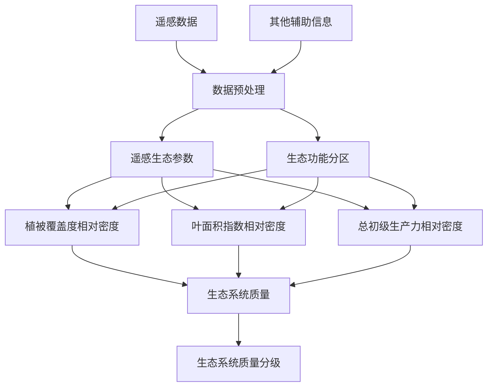

# 中华人民共和国国家生态环境标准

**HJ 1172—2021**

## 全国生态状况调查评估技术规范 ——生态系统质量评估

**Technical specification for investigation and assessment of national ecological status ——Ecosystem quality assessment**

本电子版为正式标准文本，由生态环境部环境标准研究所审校排版。

---

2021-05-12 发布 2021-08-01 实施  
生态环境部发布  
HJ 1172—2021

---

## 目录

- [前言](#前言)
- [1 适用范围](#1-适用范围)
- [2 规范性引用文件](#2-规范性引用文件)
- [3 术语和定义](#3-术语和定义)
- [4 总则](#4-总则)
- [5 技术流程](#5-技术流程)
- [6 生态系统质量评估指标与方法](#6-生态系统质量评估指标与方法)
- [7 生态系统质量分级](#7-生态系统质量分级)
- [附录A（资料性附录） 全国生态系统分类体系表](#附录a资料性附录-全国生态系统分类体系表)
- [附录B（规范性附录） 遥感关键生态参数计算方法](#附录b规范性附录-遥感关键生态参数计算方法)

---

## 前言

为贯彻《中华人民共和国环境保护法》及相关法律法规，以及《全国生态状况定期遥感调查评估方案》（环办生态〔2019〕45号），制定本标准。

本标准规定了生态系统质量评估的总则、技术流程、指标与方法和生态系统质量分级等要求。

本标准的附录A为资料性附录，附录B为规范性附录。

本标准为首次发布。

本标准与以下标准同属全国生态状况调查评估技术规范系列标准：

- 《全国生态状况调查评估技术规范——生态系统遥感解译与野外核查》（HJ 1166—2021）
- 《全国生态状况调查评估技术规范——森林生态系统野外观测》（HJ 1167—2021）
- 《全国生态状况调查评估技术规范——草地生态系统野外观测》（HJ 1168—2021）
- 《全国生态状况调查评估技术规范——湿地生态系统野外观测》（HJ 1169—2021）
- 《全国生态状况调查评估技术规范——荒漠生态系统野外观测》（HJ 1170—2021）
- 《全国生态状况调查评估技术规范——生态系统格局评估》（HJ 1171—2021）
- 《全国生态状况调查评估技术规范——生态系统服务功能评估》（HJ 1173—2021）
- 《全国生态状况调查评估技术规范——生态问题评估》（HJ 1174—2021）
- 《全国生态状况调查评估技术规范——项目尺度生态影响评估》（HJ 1175—2021）
- 《全国生态状况调查评估技术规范——数据质量控制与集成》（HJ 1176—2021）

本标准由生态环境部自然生态保护司、法规与标准司组织制订。

本标准主要起草单位：生态环境部卫星环境应用中心、中国科学院生态环境研究中心。

本标准生态环境部2021年5月12日批准。

本标准自2021年8月1日起实施。

本标准由生态环境部解释。

---

## 1 适用范围

本标准规定了区域自然生态系统质量评估的总则、技术流程、指标与方法和生态系统质量分级等要求。

本标准主要适用于全国及省级行政区陆域以植被为主的自然生态系统的质量评估，其他地理区域可参照本标准执行。

## 2 规范性引用文件

本标准引用了下列文件或其中的条款。凡是注明日期的引用文件，仅注日期的版本适用于本标准。凡是未注日期的引用文件，其最新版本（包括所有的修改单）适用于本标准。

- HJ 192 生态环境状况评价技术规范

## 3 术语和定义

下列术语和定义适用于本标准。

### 3.1 生态系统质量

**ecosystem quality**  
表征生态系统自然植被的优劣程度，反映生态系统内植被与生态系统整体状况。

### 3.2 评估单元

**assessment unit**  
根据评估目的和评估方法的需要，划分的用于评估的地理空间单元。

### 3.3 叶面积指数

**leaf area index**  
单位土地面积上植物叶片总面积与土地面积的比值，主要表征了植被垂直结构复杂性。

### 3.4 总初级生产力

**gross primary productivity**  
在单位时间和单位面积上，绿色植物通过光合作用所固定的有机碳总量，主要表征植被光合作用能力强弱。

### 3.5 植被覆盖度

**fractional vegetation cover**  
植被（包括叶、茎、枝）在地面的垂直投影面积占统计区总面积的百分比，主要表征植被水平结构状况。

## 4 总则

生态系统质量评估应遵循规范性、可操作性、先进性和经济与技术可行性的原则。

## 5 技术流程

生态系统质量评估技术规范流程：基于遥感生态参数，分区分生态系统类型开展生态系统质量评估（图1）。

## 6 生态系统质量评估指标与方法

生态系统质量评估以遥感生态参数（植被覆盖度、叶面积指数、总初级生产力）作为指标，三个参数计算方法见附录 B，采取分区分生态系统类型选取参照值的方法构建生态系统质量指数，分区参照《全国生态功能区划》的242个生态功能区边界，生态系统类型参见附录A。具体过程如下：以每个生态功能区内森林、灌丛、草地和农田四类植被类型生态系统的生态参数最大值作为参照值，依次计算分区内每个植被类型生态系统参数值与其参照值的比值，得到该分区内该生态参数的相对密度，相对密度越接近1代表该像元该生态参数越接近参照值。具体计算方法按公式（1）：

\[ RVI_{i,j,k} = \frac{F_{i,j,k}}{\max(F_{i,j,k})} \]

式中：

- \( RVI_{i,j,k} \) ——为第 \( i \) 年第 \( j \) 分区第 \( k \) 类植被生态系统生态参数的相对密度；
- \( F_{i,j,k} \) ——为第 \( i \) 年第 \( j \) 分区第 \( k \) 类植被生态系统生态参数值；
- \(\max(F_{i,j,k})\) ——为第 \( i \) 年第 \( j \) 分区第 \( k \) 类植被生态系统生态参数最大值。

依照此方法，对植被覆盖度、叶面积指数、总初级生产力分区分类型选取参照值计算相对密度，将结果归一化到0～1之间，归一化方法如下：

\[ x' = \frac{x - \min(x)}{\max(x) - \min(x)} \]

式中：

- \( x' \) ——为归一化处理后指数；
- \( x \) ——为原指数。

生态系统质量反映区域生态系统质量整体状况，由植被覆盖度、叶面积指数和总初级生产力的相对密度来构建，具体计算方法按公式（3）：

\[ EQI_{i,j} = \frac{LAI_{i,j} + FVC_{i,j} + GPP_{i,j}}{3} \times 100 \]

式中：

- \( EQI_{i,j} \) ——为第 \( i \) 年第 \( j \) 分区生态系统质量；
- \( LAI_{i,j} \) ——为第 \( i \) 年第 \( j \) 分区叶面积指数相对密度；
- \( FVC_{i,j} \) ——为第 \( i \) 年第 \( j \) 分区植被覆盖度相对密度；
- \( GPP_{i,j} \) ——为第 \( i \) 年第 \( j \) 分区总初级生产力相对密度。

## 7 生态系统质量分级

根据生态系统质量评估结果，将生态系统质量分为5级，即优、良、中、低、差，具体可参照HJ 192实施，见表1。

| 级别 | 优 | 良 | 中 | 低 | 差 |
|------|----|----|----|----|----|
| 生态系统质量 | EQI≥75 | 55≤EQI＜75 | 35≤EQI＜55 | 20≤EQI＜35 | EQI＜20 |
| 描述 | 生态系统质量为优 | 生态系统质量良好 | 生态系统质量为中等水平 | 生态系统质量较低 | 生态系统质量较差 |

## 附录A（资料性附录） 全国生态系统分类体系表

| Ⅰ级代码 | Ⅰ级分类 | Ⅱ级代码 | Ⅱ级分类 |
|----------|----------|----------|----------|
| 1 | 森林生态系统 | 11 | 阔叶林 |
|   |                | 12 | 针叶林 |
|   |                | 13 | 针阔混交林 |
|   |                | 14 | 稀疏林 |
| 2 | 灌丛生态系统 | 21 | 阔叶灌丛 |
|   |                | 22 | 针叶灌丛 |
|   |                | 23 | 稀疏灌丛 |
| 3 | 草地生态系统 | 31 | 草甸 |
|   |                | 32 | 草原 |
|   |                | 33 | 草丛 |
|   |                | 34 | 稀疏草地 |
| 4 | 湿地生态系统 | 41 | 沼泽 |
|   |                | 42 | 湖泊 |
|   |                | 43 | 河流 |
| 5 | 农田生态系统 | 51 | 耕地 |
|   |                | 52 | 园地 |
| 6 | 城镇生态系统 | 61 | 居住地 |
|   |                | 62 | 城市绿地 |
|   |                | 63 | 工矿交通 |
| 7 | 荒漠生态系统 | 71 | 沙漠 |
|   |                | 72 | 沙地 |
|   |                | 73 | 盐碱地 |
| 8 | 其他          | 81 | 冰川/永久积雪 |
|   |                | 82 | 裸地 |

## 附录B（规范性附录） 遥感关键生态参数计算方法

### B.1 叶面积指数（LAI）

叶面积指数（leaf area index，LAI）反映一个生态系统中单位面积上的叶面积大小，是模拟陆地生态系统、水热循环和生物地球化学循环的重要参数。目前基于光学数据获取叶面积指数的方法主要包括两类，一类是统计方法，常用的是建立叶面积指数与植被指数之间经验或半经验关系；一类是基于辐射传输模型的遥感反演方法。

1. **统计法**

   经验模型法是常用的统计方法，该方法是用植被指数估算叶面积指数，一般过程是建立植被指数和叶面积指数的经验关系，并使用观测数据进行拟合，再使用拟合好的模型估算叶面积指数，常用表达叶面积指数和植被指数的经验关系主要有以下几种形式：

   \[ L = Ax^3 + Bx^2 + Cx + D \]

   \[ L = A + Bx^c \]

   \[ L = -A \ln(1 - x) \]

   式中：\( L \)——叶面积指数；  
   \( x \)——从遥感数据获取的植被指数或反射率；  
   \( A \)、\( B \)、\( C \) 和 \( D \)——经验参数，随着植被类型变化。

2. **冠层模型**

   冠层模型通常可划分为四类：参数模型、几何光学模型、混合介质模型和计算机模拟模型。这些模型已在冠层形态和光学特征估算中得到广泛应用，目前基于冠层模型估算叶面积指数常采用反演优化算法、神经网络技术、遗传算法、贝叶斯网络算法和查找表方法等，可根据评估区域和所具备的实际条件选择合适的模型和方法估算叶面积指数。

### B.2 植被覆盖度（FVC）

植被覆盖度（fractional vegetation cover，FVC）量化了植被的茂密程度，反映了植被的生长态势，是描述生态系统的重要基础数据，被广泛运用于水文、生态、气候、大气污染等研究领域。遥感由于其大范围的数据获取和连续观测能力已成为估算植被覆盖度的主要技术手段。基于遥感的植被覆盖度估算方法主要有以下几种：

1. **回归（统计）模型法**

   回归（统计）模型法是通过对遥感数据的某一波段、波段组合或利用遥感数据计算的植被指数如归一化植被指数、土壤调节植被指数等与植被覆盖度进行回归分析，建立经验估算模型。线性回归模型通过地面测量的植被覆盖度与遥感图像的波段或植被指数进行线性回归得到研究区域的估算模型；非线性回归模型法主要是通过将遥感数据的波段或植被指数与植被覆盖度进行拟合，得到非线性回归模型。

2. **混合像元分解法**

   遥感图像中每个像元一般由多个组分构成，每个组分对传感器观测到的信息都有贡献，可由此建立像元分解模型进行植被覆盖度的估算。混合像元分解模型主要有线性模型、概率模型、几何光学模型、随机几何模型和模糊分析模型等，其中线性分解模型应用最为广泛。线性像元分解法中最常用的是像元二分模型，是指假定像元由植被和非植被两部分构成，光谱信息为这两个组分的线性组合。计算获得的植被覆盖所占像元比例即为该像元的植被覆盖度，计算方法如下：

   \[ FVC = \frac{NDVI - NDVI_{soil}}{NDVI_{veg} - NDVI_{soil}} \]

   式中：\( FVC \)——像元植被覆盖度；  
   \( NDVI \)——混合像元的NDVI值；  
   \( NDVI_{soil} \)——纯裸土覆盖像元的NDVI值；  
   \( NDVI_{veg} \)——纯植被覆盖像元的NDVI值。

   由于受土壤、植被类型等因素的影响，目前\( NDVI_{soil} \)和\( NDVI_{veg} \)主要通过对图像的统计分析确定，如直接将图像中NDVI的最大值和最小值分别作为纯植被覆盖和纯裸土覆盖的NDVI值。

3. **机器学习法**

   随着计算机技术的发展，机器学习法被广泛应用到植被覆盖度的估算中，包括神经网络、决策树、支持向量机等。机器学习方法的步骤一般为确定训练样本、训练模型和估算植被覆盖度。根据训练样本选取的不同，机器学习方法分为基于遥感影像分类和基于辐射传输模型两大类。

   基于遥感影像分类的方法首先采用高空间分辨率数据进行分类，区分出植被和非植被，再将分类结果聚合到低空间分辨率尺度，计算低空间分辨率像元中植被的比例作为训练样本，训练机器学习模型，进而估算植被覆盖度。

   基于辐射传输模型的方法首先由辐射传输模型模拟出不同参数情况下的光谱反射率值，再根据传感器的光谱响应函数将模拟的光谱反射率值重采样，不同的参数和模拟的波段值作为训练样本对机器学习模型进行训练。机器学习方法的关键在于训练样本的选择，要确保准确性和代表性。

4. **其他方法**

   除了上述常用植被覆盖度遥感估算方法，主要还有物理模型法、光谱梯度差法、FCD（forest canopy density）分级法等。

   植被覆盖度估算可根据评估区域特点和已有条件选择适用的估算方法。

### B.3 总初级生产力（GPP）

总初级生产力（gross primary productivity，GPP）指在单位时间和单位面积上，绿色植物通过光合作用所固定的有机碳总量。陆地总初级生产力是描述陆地生态系统的重要参数，提供了全球气候变化情况下碳循环的定量化描述。

目前通用的估测总初级生产力方法主要有通量站连续观测、陆地生态过程模型估测等方法。通量站连续观测是利用涡度相关法测量大气与生态系统边界的交换，包括碳、水等物质，从而间接计算出生态系统总初级生产力的量。涡度相关技术实现了定量连续测量陆地生物圈-大气圈碳和水汽交换，是在生态系统尺度上解释陆气交换作用的最有效方法。陆地生态过程模型则是结合陆地表面过程、植被冠层生理等生态系统过程要素开发出的模型。结合遥感数据的GPP估测模型实现了空间连续、不破坏植被的植被总初级生产力估测。遥感估测总初级生产力模型主要分为3类：经验型植被指数模型、植被生态过程模型及机器学习模型，可根据评估区域和所具备的实际条件选择合适的模型和方法估算总初级生产力。
